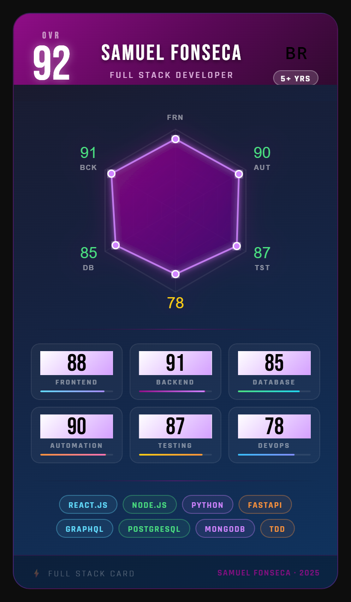

<div align="center">


</div>

<br/>

<div align="center">
  
</div>

<br/>

<!-- No README.md, adicione onde quiser: -->
<div align="center">
  
</div>


---

## 🃏 About Me

```javascript
const samuel = {
  role:       "Full Stack Developer",
  location:   "Brasil 🇧🇷",
  experience: "4+ years",
  
  mainStack:  ["React.js", "Node.js", "Python", "Flask", "FastAPI"],
  databases:  ["PostgreSQL", "MongoDB"],
  practices:  ["TDD", "Scrum", "Kanban", "Clean Code"],
  
  currentlyLearning: ["TypeScript", "Kubernetes", "AWS"],
  
  passion:    "Automating processes & solving complex problems",
  
  motto:      "Code with purpose, ship with confidence 🚀"
};
```

<br/>

---

## ⚡ Tech Arsenal

### 🔥 Main Stack
&nbsp;
&nbsp;
&nbsp;
&nbsp;
&nbsp;
&nbsp;
&nbsp;

### 🎨 Frontend
&nbsp;
&nbsp;
&nbsp;

### 🗄️ Databases
&nbsp;
&nbsp;

### 🧪 Testing & QA
&nbsp;
&nbsp;

### 🚀 Currently Leveling Up
&nbsp;
&nbsp;

### 🛠️ Workstation
&nbsp;
&nbsp;
&nbsp;
&nbsp;

<br/>

---

## 📊 GitHub Stats

<div align="center">
  
  
</div>

<div align="center">
  
</div>

<br/>

---

## 🏆 Achievements

<div align="center">
  
</div>

<br/>

---

## 📡 Let's Connect

<div align="center">
  
[](https://www.linkedin.com/in/samuel-fonseca-0289a6121/)
[](mailto:contato.samuelbatista3rios@gmail.com)

</div>

<br/>

---

<div align="center">
  
  

</div>

<div align="center">
  
</div>


